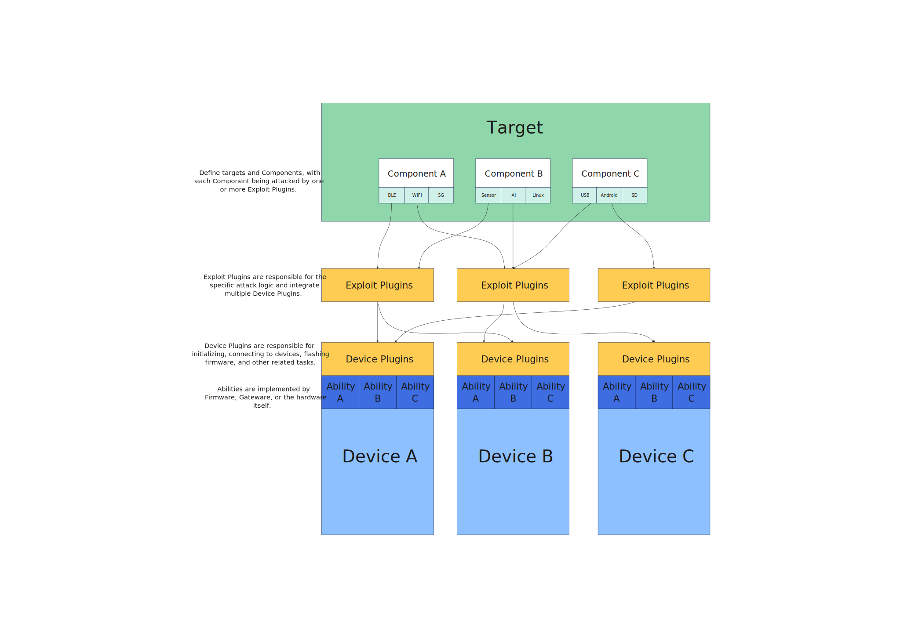

Welcome to IoTSploit's documentation!
=====================================

**IoTSploit** is an open-source cybersecurity testing framework designed for IoT (Internet of Things) devices. It serves as a comprehensive suite of tools for identifying vulnerabilities and ensuring the robustness of IoT systems against potential threats.

Key features of IoTSploit include:

* **Vulnerability Detection**: Built-in tools to identify common IoT device vulnerabilities.
* **Modular Design**: Flexibly integrate and swap out testing scripts and hardware.
* **Multi-Transport Support**: Compatibility with various IoT protocols like MQTT, CoAP, and Zigbee.
* **Automation Features**: Enables automated and repeatable testing processes.
* **Community Support**: Offers detailed documentation and strong community backing.

Check out the :doc:`get-started` section for further information, including
how to :ref:`installation` the project.

.. note::

   This project is under active development.

Contents
--------

.. toctree::

   get-started
   features
   community