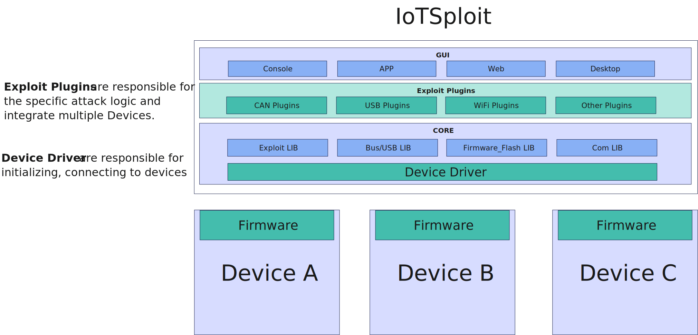
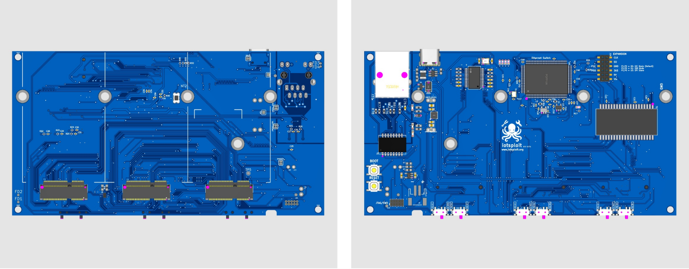

Welcome to IoTSploit's documentation!
=====================================

**IoTSploit**  is a cutting-edge, modular hacking toolkit that seamlessly integrates both software and hardware components. This innovative platform offers unparalleled flexibility through its plugin-based architecture:

Key features of IoTSploit include:

1. **Hardware Modularity**
   Leveraging the versatile M2 KEYE slot, IoTSploit enables seamless integration of diverse hardware modules. This adaptability ensures the toolkit evolves alongside emerging IoT technologies and security challenges.

2. **Software Extensibility**
   At the core of IoTSploit lies a plugin-driven software framework, serving as its cognitive center. This modular architecture efficiently manages hardware components while expanding functionality, empowering security researchers and ethical hackers to effortlessly develop, integrate, and deploy custom tools and techniques.

3. **User-Friendly Interface**
   IoTSploit abstracts complex hardware interactions behind a unified software interface, significantly lowering the barrier to entry for IoT security testing. This intuitive design empowers practitioners of all skill levels to conduct thorough and effective security assessments with confidence.

Features
--------

IoTSploit offers a comprehensive set of features designed to facilitate IoT security testing and research.

Software Features
^^^^^^^^^^^^^^^^^

1. **Interactive Shell**: A user-friendly command-line interface for seamless interaction with the toolkit.
2. **Exploit Framework**: Run and manage multiple exploit plugins for comprehensive vulnerability assessments.
3. **Plugin Architecture**: Easily extend functionality through a modular plugin system for both exploits and device management.
4. **Device Management**: Interact with and gather information from connected IoT devices.
5. **OTA Management**: Check and manage software versions on IoT devices.
6. **Flexible Testing Framework**: Support for various test levels and projects, allowing customized testing scenarios.
7. **Integrated Reporting**: Comprehensive logging and reporting capabilities for test results and system interactions.
8. **Django Integration**: Built-in Django server for web-based interactions and reporting.
9. **Network Configuration**: Tools for managing Wi-Fi connections and network settings.

Hardware Features
^^^^^^^^^^^^^^^^^

1. **M2 KEYE Slot**: A versatile hardware interface allowing for quick swapping of various hardware modules.
2. **Modular Design**: Easily interchange hardware components to adapt to different IoT testing scenarios.
3. **Extensible Hardware Support**: The ability to integrate new hardware modules as IoT technologies evolve.
4. **Unified Hardware Interface**: Abstract complex hardware interactions through a consistent software interface.

.. note::
   The combination of flexible software and modular hardware makes IoTSploit a powerful and adaptable platform for comprehensive IoT security testing.

Check out the :doc:`get-started` section for further information, including
how to :ref:`installation` the project.

.. note::

   This project is under active development.

Contents
--------

.. toctree::
   :maxdepth: 2
   :caption: Welcome to IoTSploit's documentation!

   get-started
   features
   community

.. toctree::
   :maxdepth: 2
   :caption: Tutorials

   tutorials/installation
   tutorials/basic-commands
   tutorials/plugin
   tutorials/hardware-pinout

.. toctree::
   :maxdepth: 2
   :caption: Reference

   api
