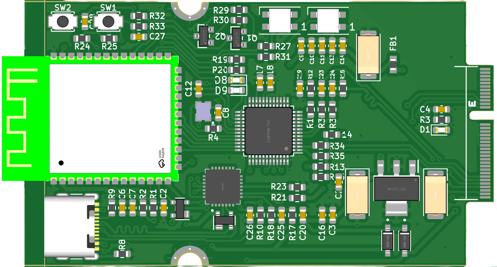

IoTSploit ESP32 Board
==================

   IoTSploit ESP32 Development Board

The IoTSploit ESP32 development board features an ESP32-S3-WROOM-1 module as its core,
complemented by extensive networking capabilities and robust power management. Here are the
key features of the IoTSploit ESP32 board:

* ESP32-S3-WROOM-1 module
    * Dual-core ESP32-S3 microcontroller
    * Built-in Wi-Fi and Bluetooth 5 (LE) connectivity
    * Rich set of peripherals
* Ethernet connectivity with W5500 controller
* USB Type-C connector with USB 2.0 support
* CP2102N USB-to-UART bridge for programming and debugging
* Multiple power management features:
    * TC1264-3.3V voltage regulator
    * USB power protection (SP0503BAHT)
    * Multiple power filtering options
* Debugging and programming:
    * Dedicated RESET and BOOT buttons
    * USB programming interface
    * Multiple debug test points
* Status indicators:
    * RGB LED indicators (SK6812)
    * Power and status LEDs
    * Programmable indicator LEDs

ESP32 Hardware Components
----------------------

The IoTSploit ESP32 board provides the following hardware components:

* ESP32-S3-WROOM-1 Module
    * Dual-core ESP32-S3 processor
    * 25MHz crystal oscillator for precise timing
    * Integrated Wi-Fi and Bluetooth
    * Multiple GPIO pins for expansion

* Networking
    * W5500 Ethernet controller
    * 25MHz Ethernet crystal (ECS-2033-250-BN)
    * Integrated TCP/IP stack
    * High-speed SPI interface

* USB Interface
    * USB Type-C connector with USB 2.0 support
    * CP2102N USB-to-UART bridge
    * ESD protection (SP0503BAHT)
    * USB power management

* Power Management
    * TC1264-3.3V voltage regulator
    * Multiple power filtering capacitors
    * Power protection diodes (1N5819HW)
    * Precision voltage dividers

* Visual Feedback
    * Programmable RGB LEDs (SK6812)
    * Status indicator LEDs
    * Power indicator LED

ESP32 Supported Features
---------------------

+-----------+------------+-------------------------------------+
| Interface | Controller | Driver/Component                    |
+===========+============+=====================================+
| Wi-Fi     | on-chip    | 802.11 b/g/n                        |
+-----------+------------+-------------------------------------+
| Bluetooth | on-chip    | BLE 5.0                             |
+-----------+------------+-------------------------------------+
| UART      | on-chip    | CP2102N bridge                      |
+-----------+------------+-------------------------------------+
| GPIO      | on-chip    | gpio                                |
+-----------+------------+-------------------------------------+
| USB       | CP2102N    | USB-UART bridge                     |
+-----------+------------+-------------------------------------+
| Ethernet  | W5500      | 10/100 Ethernet                     |
+-----------+------------+-------------------------------------+
| SPI       | on-chip    | Multiple peripherals                |
+-----------+------------+-------------------------------------+
| I2C       | on-chip    | Sensor interface                    |
+-----------+------------+-------------------------------------+

ESP32 System Clock
---------------

The IoTSploit ESP32 board uses a 25MHz crystal oscillator for the main system clock,
with an additional dedicated 25MHz crystal for the Ethernet controller.

ESP32 Programming and Debugging
---------------------------

The board features multiple programming and debugging interfaces:

* USB-to-UART bridge (CP2102N) for programming and debugging
* Dedicated BOOT and RESET buttons for easy programming mode entry
* Multiple debug test points for external access

ESP32 Programming Methods
---------------------

The board can be programmed through:

* USB interface using the CP2102N bridge
* External programming interface via debug headers
* OTA (Over-The-Air) updates via Wi-Fi

.. note::
   The board includes dedicated BOOT and RESET buttons for easy programming mode access,
   and multiple test points for debugging and development.

ESP32 Power Management
------------------

The board features a robust power management system:

* TC1264-3.3V regulator for stable power supply
* Multiple filtering capacitors for clean power
* USB power protection circuitry
* Power indicator LEDs for status monitoring

.. warning::
   When using external power sources, ensure they do not exceed the maximum voltage
   ratings of the onboard components. 