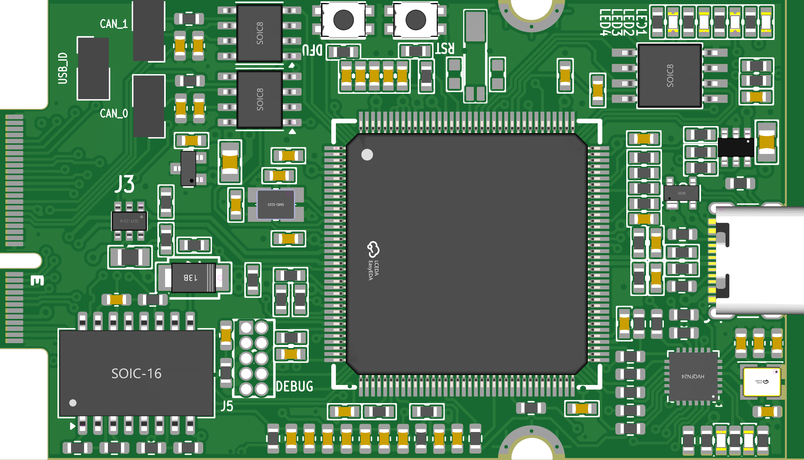

Overview
********

   IoTSploit Development Board

The IoTSploit development board features an NXP LPC4330FBD144 dual-core microcontroller
with extensive connectivity support and configurations. Here are the key features of the
IoTSploit board:

* LPC4330 microcontroller in LQFP144 package
* Dual CAN interfaces with TJA1042T-3 transceivers
* USB Type-C connector with USB 2.0 support
* 10/100 Ethernet with LAN8720A PHY
* External flash memory (W25Q16DV)
* Multiple power management features:
    * AP7333 voltage regulator
    * AP22653AW6-7 power management IC
    * USB power protection (IP4220CZ6)
* Debugging and programming:
    * DFU and RESET buttons
    * SPIFI programming interface
    * Debug test points
* Status indicators:
    * Multiple LED indicators
    * Power status LEDs

Hardware
********

The IoTSploit board provides the following hardware components:

* LPC4330FBD144 Microcontroller
    * Dual-core ARM Cortex-M4/M0 processor
    * High-speed and low-speed external crystals (25MHz and MCU_XTAL)
    * 1.8V core voltage with AP7333 regulator
    * Multiple power domains with bypass options

* Memory
    * W25Q16DV external SPI flash memory
    * Configurable memory interfaces

* Networking
    * 10/100 Ethernet with LAN8720A PHY
    * H1102NLT transformer for Ethernet isolation
    * Dual CAN interfaces with TJA1042T-3 transceivers

* USB Interface
    * USB Type-C connector with USB 2.0 support
    * ESD protection (SP0503BAHT)
    * VBUS sensing and power management
    * USB power protection circuit

Supported Features
=================

+-----------+------------+-------------------------------------+
| Interface | Controller | Driver/Component                    |
+===========+============+=====================================+
| NVIC      | on-chip    | nested vector interrupt controller  |
+-----------+------------+-------------------------------------+
| UART      | on-chip    | serial port                         |
+-----------+------------+-------------------------------------+
| GPIO      | on-chip    | gpio                                |
+-----------+------------+-------------------------------------+
| USB       | on-chip    | USB device                          |
+-----------+------------+-------------------------------------+
| CAN       | on-chip    | Dual CAN controller                 |
+-----------+------------+-------------------------------------+
| ETHERNET  | on-chip    | ethernet                            |
+-----------+------------+-------------------------------------+
| SPI Flash | on-chip    | flash memory                        |
+-----------+------------+-------------------------------------+

System Clock
===========

The IoTSploit board is configured to use the 25MHz external oscillator 
with additional MCU_XTAL for precise timing operations.

Programming and Debugging
***********************

The IoTSploit board includes both DFU and SPIFI programming interfaces.

Flashing
========

The board can be flashed through:

* DFU bootloader using the USB interface
* SPIFI programming interface
* Debug test points for external programmers

.. note::
   The board includes multiple test points for debugging and programming access. 